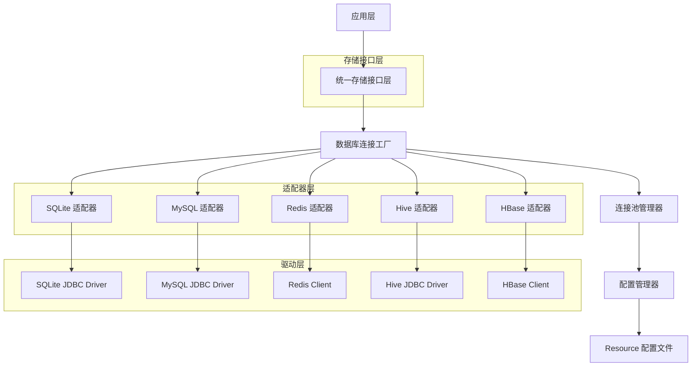
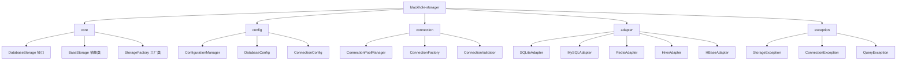

# Blackhole-Storager 多数据库存储扩展技术架构文档

## 1. 架构设计

### 1.1 整体架构图


### 1.2 模块架构图


## 2. 技术描述

### 2.1 核心技术栈
- **后端**: Java 8+ / Maven 3.6+
- **数据库驱动**: 
  - SQLite: Xerial SQLite JDBC 3.36+
  - MySQL: MySQL Connector/J 8.0+
  - Redis: Jedis 4.0+ / Lettuce 6.0+
  - Hive: Hive JDBC 3.1+
  - HBase: HBase Client 2.4+
- **连接池**: HikariCP 5.0+ (SQL数据库), Commons Pool2 (Redis)
- **配置管理**: Jackson YAML 2.13+
- **日志**: SLF4J + Logback
- **测试**: JUnit 5 + Mockito

### 2.2 依赖管理
```xml
<!-- 核心依赖 -->
<dependencies>
    <!-- SQLite -->
    <dependency>
        <groupId>org.xerial</groupId>
        <artifactId>sqlite-jdbc</artifactId>
        <version>3.36.0.3</version>
    </dependency>
    
    <!-- MySQL -->
    <dependency>
        <groupId>mysql</groupId>
        <artifactId>mysql-connector-java</artifactId>
        <version>8.0.33</version>
    </dependency>
    
    <!-- Redis -->
    <dependency>
        <groupId>redis.clients</groupId>
        <artifactId>jedis</artifactId>
        <version>4.4.3</version>
    </dependency>
    
    <!-- Hive -->
    <dependency>
        <groupId>org.apache.hive</groupId>
        <artifactId>hive-jdbc</artifactId>
        <version>3.1.3</version>
    </dependency>
    
    <!-- HBase -->
    <dependency>
        <groupId>org.apache.hbase</groupId>
        <artifactId>hbase-client</artifactId>
        <version>2.4.15</version>
    </dependency>
    
    <!-- 连接池 -->
    <dependency>
        <groupId>com.zaxxer</groupId>
        <artifactId>HikariCP</artifactId>
        <version>5.0.1</version>
    </dependency>
    
    <!-- 配置管理 -->
    <dependency>
        <groupId>com.fasterxml.jackson.dataformat</groupId>
        <artifactId>jackson-dataformat-yaml</artifactId>
        <version>2.15.2</version>
    </dependency>
</dependencies>
```

## 3. 核心接口定义

### 3.1 统一存储接口
```java
package com.collections.blackhole.core;

import java.util.List;
import java.util.Map;
import java.util.Optional;

public interface DatabaseStorage {
    
    // 生命周期管理
    void initialize() throws StorageException;
    void shutdown() throws StorageException;
    boolean isHealthy();
    
    // 单条查询
    <T> Optional<T> querySingle(String sql, RowMapper<T> mapper, Object... params) throws StorageException;
    
    // 多条查询
    <T> List<T> queryMultiple(String sql, RowMapper<T> mapper, Object... params) throws StorageException;
    
    // 分页查询
    <T> Page<T> queryPage(String sql, RowMapper<T> mapper, int pageNum, int pageSize, Object... params) throws StorageException;
    
    // 插入操作
    int insert(String table, Map<String, Object> data) throws StorageException;
    int[] insertBatch(String table, List<Map<String, Object>> dataList) throws StorageException;
    
    // 更新操作
    int update(String table, Map<String, Object> data, String condition, Object... params) throws StorageException;
    int[] updateBatch(String table, List<Map<String, Object>> dataList, String condition) throws StorageException;
    
    // 删除操作
    int delete(String table, String condition, Object... params) throws StorageException;
    int deleteBatch(String table, List<String> conditions) throws StorageException;
    
    // 事务管理
    void beginTransaction() throws StorageException;
    void commit() throws StorageException;
    void rollback() throws StorageException;
    boolean isInTransaction();
}
```

### 3.2 行映射器接口
```java
package com.collections.blackhole.core;

@FunctionalInterface
public interface RowMapper<T> {
    T mapRow(ResultSet rs, int rowNum) throws SQLException;
}
```

### 3.3 分页结果类
```java
package com.collections.blackhole.core;

import java.util.List;

public class Page<T> {
    private final List<T> content;
    private final int pageNum;
    private final int pageSize;
    private final long totalElements;
    private final int totalPages;
    
    // 构造函数和getter方法
    public Page(List<T> content, int pageNum, int pageSize, long totalElements) {
        this.content = content;
        this.pageNum = pageNum;
        this.pageSize = pageSize;
        this.totalElements = totalElements;
        this.totalPages = (int) Math.ceil((double) totalElements / pageSize);
    }
}
```

### 3.4 配置类定义
```java
package com.collections.blackhole.config;

import java.util.Map;

public class DatabaseConfig {
    private String type;
    private String name;
    private Map<String, Object> properties;
    private ConnectionPoolConfig pool;
    
    // getter和setter方法
}

public class ConnectionPoolConfig {
    private int maxPoolSize = 10;
    private int minPoolSize = 2;
    private long connectionTimeout = 30000;
    private long idleTimeout = 600000;
    private long maxLifetime = 1800000;
    
    // getter和setter方法
}
```

## 4. 数据库适配器实现

### 4.1 基础适配器抽象类
```java
package com.collections.blackhole.adapter;

import com.collections.blackhole.core.DatabaseStorage;
import com.collections.blackhole.core.StorageException;
import com.collections.blackhole.connection.ConnectionPoolManager;
import com.collections.blackhole.config.DatabaseConfig;

public abstract class BaseStorageAdapter implements DatabaseStorage {
    
    protected final DatabaseConfig config;
    protected final ConnectionPoolManager connectionPool;
    protected volatile boolean initialized = false;
    protected volatile boolean inTransaction = false;
    
    protected BaseStorageAdapter(DatabaseConfig config) {
        this.config = config;
        this.connectionPool = createConnectionPool();
    }
    
    protected abstract ConnectionPoolManager createConnectionPool();
    
    @Override
    public void initialize() throws StorageException {
        if (initialized) {
            return;
        }
        
        try {
            connectionPool.initialize();
            testConnection();
            initialized = true;
        } catch (Exception e) {
            throw new StorageException("Failed to initialize storage adapter", e);
        }
    }
    
    protected abstract void testConnection() throws Exception;
    
    @Override
    public void shutdown() throws StorageException {
        if (!initialized) {
            return;
        }
        
        try {
            connectionPool.shutdown();
            initialized = false;
        } catch (Exception e) {
            throw new StorageException("Failed to shutdown storage adapter", e);
        }
    }
    
    @Override
    public boolean isHealthy() {
        return initialized && connectionPool.isHealthy();
    }
    
    protected void checkInitialized() throws StorageException {
        if (!initialized) {
            throw new StorageException("Storage adapter not initialized");
        }
    }
}
```

### 4.2 SQLite 适配器
```java
package com.collections.blackhole.adapter;

import com.collections.blackhole.config.DatabaseConfig;
import com.zaxxer.hikari.HikariConfig;
import com.zaxxer.hikari.HikariDataSource;

public class SQLiteAdapter extends BaseStorageAdapter {
    
    private HikariDataSource dataSource;
    
    public SQLiteAdapter(DatabaseConfig config) {
        super(config);
    }
    
    @Override
    protected ConnectionPoolManager createConnectionPool() {
        HikariConfig hikariConfig = new HikariConfig();
        hikariConfig.setJdbcUrl((String) config.getProperties().get("url"));
        hikariConfig.setDriverClassName("org.sqlite.JDBC");
        hikariConfig.setMaximumPoolSize(config.getPool().getMaxPoolSize());
        hikariConfig.setMinimumIdle(config.getPool().getMinPoolSize());
        hikariConfig.setConnectionTimeout(config.getPool().getConnectionTimeout());
        
        this.dataSource = new HikariDataSource(hikariConfig);
        return new HikariConnectionPoolManager(dataSource);
    }
    
    @Override
    protected void testConnection() throws Exception {
        try (Connection conn = dataSource.getConnection()) {
            conn.prepareStatement("SELECT 1").execute();
        }
    }
    
    // CRUD 方法实现...
}
```

### 4.3 MySQL 适配器
```java
package com.collections.blackhole.adapter;

import com.collections.blackhole.config.DatabaseConfig;
import com.zaxxer.hikari.HikariConfig;
import com.zaxxer.hikari.HikariDataSource;

public class MySQLAdapter extends BaseStorageAdapter {
    
    private HikariDataSource dataSource;
    
    public MySQLAdapter(DatabaseConfig config) {
        super(config);
    }
    
    @Override
    protected ConnectionPoolManager createConnectionPool() {
        HikariConfig hikariConfig = new HikariConfig();
        
        String host = (String) config.getProperties().get("host");
        int port = (int) config.getProperties().get("port");
        String database = (String) config.getProperties().get("database");
        
        String jdbcUrl = String.format("jdbc:mysql://%s:%d/%s?useSSL=false&serverTimezone=UTC", 
                                      host, port, database);
        
        hikariConfig.setJdbcUrl(jdbcUrl);
        hikariConfig.setUsername((String) config.getProperties().get("username"));
        hikariConfig.setPassword((String) config.getProperties().get("password"));
        hikariConfig.setMaximumPoolSize(config.getPool().getMaxPoolSize());
        hikariConfig.setMinimumIdle(config.getPool().getMinPoolSize());
        
        this.dataSource = new HikariDataSource(hikariConfig);
        return new HikariConnectionPoolManager(dataSource);
    }
    
    // CRUD 方法实现...
}
```

### 4.4 Redis 适配器
```java
package com.collections.blackhole.adapter;

import com.collections.blackhole.config.DatabaseConfig;
import redis.clients.jedis.JedisPool;
import redis.clients.jedis.JedisPoolConfig;
import redis.clients.jedis.Jedis;

public class RedisAdapter extends BaseStorageAdapter {
    
    private JedisPool jedisPool;
    
    public RedisAdapter(DatabaseConfig config) {
        super(config);
    }
    
    @Override
    protected ConnectionPoolManager createConnectionPool() {
        JedisPoolConfig poolConfig = new JedisPoolConfig();
        poolConfig.setMaxTotal(config.getPool().getMaxPoolSize());
        poolConfig.setMinIdle(config.getPool().getMinPoolSize());
        poolConfig.setMaxWaitMillis(config.getPool().getConnectionTimeout());
        
        String host = (String) config.getProperties().get("host");
        int port = (int) config.getProperties().get("port");
        String password = (String) config.getProperties().get("password");
        int database = (int) config.getProperties().get("database");
        
        if (password != null && !password.isEmpty()) {
            this.jedisPool = new JedisPool(poolConfig, host, port, 2000, password, database);
        } else {
            this.jedisPool = new JedisPool(poolConfig, host, port, 2000, null, database);
        }
        
        return new JedisConnectionPoolManager(jedisPool);
    }
    
    // Redis 特定的 CRUD 方法实现...
}
```

## 5. 配置管理设计

### 5.1 配置文件结构
```
blackhole-storager/
├── resource/
│   ├── database-dev.yml
│   ├── database-test.yml
│   ├── database-prod.yml
│   └── database-default.yml
├── src/
│   └── main/
│       └── resources/
│           └── database.yml (默认配置)
```

### 5.2 配置加载器
```java
package com.collections.blackhole.config;

import com.fasterxml.jackson.databind.ObjectMapper;
import com.fasterxml.jackson.dataformat.yaml.YAMLFactory;
import java.io.InputStream;
import java.nio.file.Files;
import java.nio.file.Path;
import java.nio.file.Paths;

public class ConfigurationManager {
    
    private static final String DEFAULT_CONFIG_FILE = "database.yml";
    private static final String RESOURCE_DIR = "resource";
    private static final ObjectMapper yamlMapper = new ObjectMapper(new YAMLFactory());
    
    private final DatabaseConfiguration configuration;
    
    public ConfigurationManager() throws ConfigurationException {
        this.configuration = loadConfiguration();
    }
    
    private DatabaseConfiguration loadConfiguration() throws ConfigurationException {
        // 1. 尝试从 resource 目录加载环境特定配置
        String env = System.getProperty("env", "default");
        Path envConfigPath = Paths.get(RESOURCE_DIR, "database-" + env + ".yml");
        
        if (Files.exists(envConfigPath)) {
            try {
                return yamlMapper.readValue(Files.newInputStream(envConfigPath), DatabaseConfiguration.class);
            } catch (Exception e) {
                throw new ConfigurationException("Failed to load environment config: " + envConfigPath, e);
            }
        }
        
        // 2. 尝试从 classpath 加载默认配置
        try (InputStream is = getClass().getClassLoader().getResourceAsStream(DEFAULT_CONFIG_FILE)) {
            if (is != null) {
                return yamlMapper.readValue(is, DatabaseConfiguration.class);
            }
        } catch (Exception e) {
            throw new ConfigurationException("Failed to load default config", e);
        }
        
        // 3. 创建默认配置
        return createDefaultConfiguration();
    }
    
    private DatabaseConfiguration createDefaultConfiguration() {
        DatabaseConfiguration config = new DatabaseConfiguration();
        // 设置默认配置值
        return config;
    }
    
    public DatabaseConfiguration getConfiguration() {
        return configuration;
    }
}
```

## 6. 异常处理设计

### 6.1 异常层次结构
```java
package com.collections.blackhole.exception;

public class StorageException extends Exception {
    private final String errorCode;
    private final Object[] params;
    
    public StorageException(String message) {
        super(message);
        this.errorCode = "STORAGE_ERROR";
        this.params = new Object[0];
    }
    
    public StorageException(String message, Throwable cause) {
        super(message, cause);
        this.errorCode = "STORAGE_ERROR";
        this.params = new Object[0];
    }
    
    public StorageException(String errorCode, String message, Object... params) {
        super(message);
        this.errorCode = errorCode;
        this.params = params;
    }
    
    public String getErrorCode() {
        return errorCode;
    }
    
    public Object[] getParams() {
        return params;
    }
}

public class ConnectionException extends StorageException {
    public ConnectionException(String message) {
        super("CONNECTION_ERROR", message);
    }
    
    public ConnectionException(String message, Throwable cause) {
        super("CONNECTION_ERROR", message, cause);
    }
}

public class QueryException extends StorageException {
    private final String sql;
    private final Object[] params;
    
    public QueryException(String sql, Object[] params, String message, Throwable cause) {
        super("QUERY_ERROR", message, cause);
        this.sql = sql;
        this.params = params;
    }
    
    public String getSql() {
        return sql;
    }
    
    public Object[] getParams() {
        return params;
    }
}
```

## 7. 使用示例

### 7.1 基本使用
```java
// 1. 初始化存储管理器
ConfigurationManager configManager = new ConfigurationManager();
StorageFactory factory = new StorageFactory(configManager.getConfiguration());

// 2. 获取数据库实例
DatabaseStorage mysqlStorage = factory.getStorage("mysql");
mysqlStorage.initialize();

// 3. 执行查询
String sql = "SELECT * FROM articles WHERE status = ?";
List<Article> articles = mysqlStorage.queryMultiple(
    sql,
    (rs, rowNum) -> new Article(rs.getLong("id"), rs.getString("title")),
    "published"
);

// 4. 插入数据
Map<String, Object> data = new HashMap<>();
data.put("title", "新文章");
data.put("content", "文章内容");
data.put("status", "published");
int rows = mysqlStorage.insert("articles", data);

// 5. 事务操作
mysqlStorage.beginTransaction();
try {
    mysqlStorage.insert("articles", data1);
    mysqlStorage.update("articles", data2, "id = ?", 123);
    mysqlStorage.commit();
} catch (Exception e) {
    mysqlStorage.rollback();
}

// 6. 关闭连接
mysqlStorage.shutdown();
```

### 7.2 Redis 使用示例
```java
// 获取 Redis 存储实例
DatabaseStorage redisStorage = factory.getStorage("redis");
redisStorage.initialize();

// 设置键值
Map<String, Object> data = new HashMap<>();
data.put("key", "user:123");
data.put("value", "用户信息");
redisStorage.insert("string", data);

// 获取值
Optional<String> value = redisStorage.querySingle(
    "GET user:123",
    (rs, rowNum) -> rs.getString("value")
);
```

## 8. 性能优化

### 8.1 连接池优化
- **HikariCP**: 针对 SQL 数据库优化，支持 JMX 监控
- **Commons Pool2**: 针对 Redis 等 NoSQL 数据库
- **连接预热**: 系统启动时预先建立连接
- **连接验证**: 定期验证连接有效性

### 8.2 查询优化
- **预编译语句**: 使用 PreparedStatement 防止 SQL 注入
- **批量操作**: 支持批量插入、更新、删除
- **分页查询**: 避免一次性加载大量数据
- **索引优化**: 提供索引建议工具

### 8.3 缓存策略
- **本地缓存**: 对频繁查询的数据进行本地缓存
- **分布式缓存**: 支持 Redis 作为二级缓存
- **缓存失效**: 支持 TTL 和 LRU 策略

## 9. 监控与运维

### 9.1 监控指标
- **连接池指标**: 活跃连接数、空闲连接数、等待时间
- **查询性能**: 平均响应时间、95%分位数、错误率
- **存储容量**: 数据库大小、表数量、索引数量
- **系统资源**: CPU、内存、磁盘使用率

### 9.2 日志管理
- **操作日志**: 记录所有数据库操作
- **错误日志**: 记录异常和错误信息
- **性能日志**: 记录慢查询和性能瓶颈
- **审计日志**: 记录用户操作和权限变更

## 10. 安全设计

### 10.1 连接安全
- **加密传输**: 支持 SSL/TLS 加密连接
- **认证机制**: 支持用户名密码、证书认证
- **权限控制**: 基于角色的访问控制
- **连接白名单**: 限制可连接的主机

### 10.2 数据安全
- **数据加密**: 支持敏感数据加密存储
- **数据脱敏**: 支持敏感信息脱敏显示
- **备份策略**: 定期备份和数据恢复
- **访问审计**: 记录数据访问日志