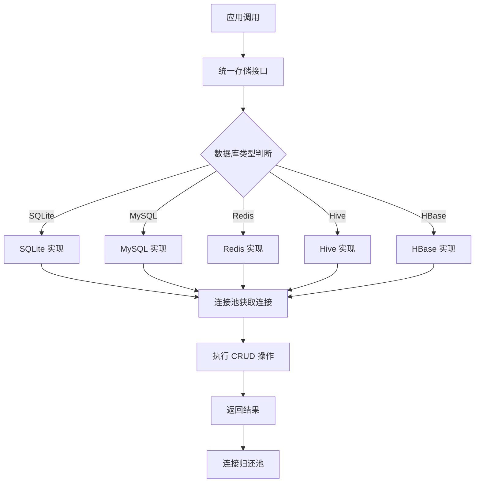
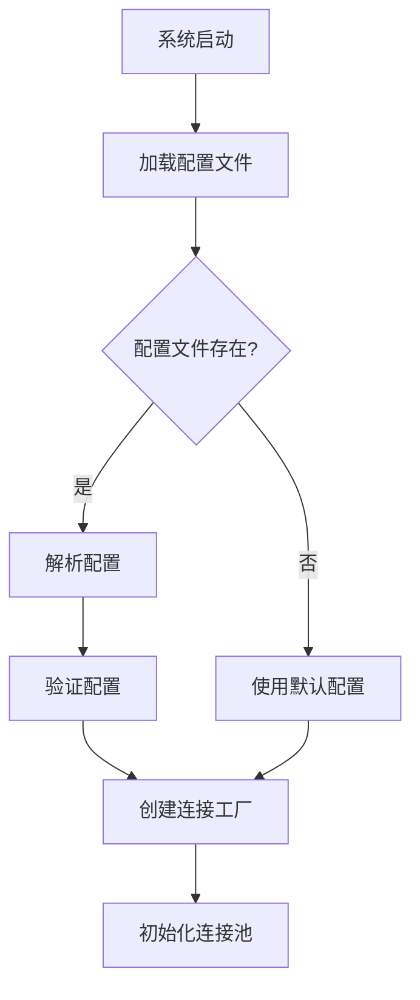

# Blackhole-Storager 多数据库存储扩展需求文档

## 1. 产品概述
Blackhole-Storager 模块是 Collections 项目的数据存储核心，目前仅支持文件追加写入。本扩展旨在为模块添加多种主流数据库存储能力，支持 SQLite、MySQL、Redis、Hive、HBase 五种数据库，提供统一的 CRUD 操作接口，满足不同数据类型和规模的存储需求。

- 目标用户：需要灵活数据存储方案的爬虫系统开发者
- 核心价值：提供统一的数据库存储抽象层，支持多种数据库的无缝切换

## 2. 核心功能

### 2.1 用户角色
| 角色 | 注册方式 | 核心权限 |
|------|----------|----------|
| 系统开发者 | 代码集成 | 使用数据库存储接口，配置连接参数 |
| 运维人员 | 配置文件管理 | 修改数据库连接配置，监控连接状态 |

### 2.2 功能模块
多数据库存储扩展包含以下核心模块：

1. **统一存储接口层**：定义标准的数据库操作方法
2. **数据库连接管理**：连接池管理和连接工厂
3. **配置管理系统**：支持多数据库配置和动态加载
4. **CRUD 操作实现**：五种数据库的具体操作实现
5. **异常处理机制**：统一的错误处理和重试机制
6. **事务管理**：支持数据库事务操作

### 2.3 页面/接口详情

| 模块名称 | 功能名称 | 功能描述 |
|----------|----------|----------|
| 统一存储接口 | 数据库连接 | 建立数据库连接，支持连接池管理 |
| 统一存储接口 | 单条查询 | 根据条件查询单条记录 |
| 统一存储接口 | 多条查询 | 根据条件查询多条记录，支持分页 |
| 统一存储接口 | 数据插入 | 插入单条或多条数据 |
| 统一存储接口 | 数据更新 | 根据条件更新数据 |
| 统一存储接口 | 数据删除 | 根据条件删除数据 |
| 配置管理 | 配置加载 | 从 resource 文件夹加载数据库配置 |
| 配置管理 | 配置验证 | 验证数据库连接配置的有效性 |
| 连接管理 | 连接池管理 | 管理数据库连接池，支持连接复用 |
| 连接管理 | 连接监控 | 监控连接状态，自动重连 |
| 异常处理 | 错误封装 | 统一封装数据库操作异常 |
| 异常处理 | 重试机制 | 支持失败操作的重试 |

## 3. 核心流程

### 3.1 数据库操作流程


### 3.2 配置加载流程


## 4. 技术规范

### 4.1 数据库支持版本
- **SQLite**: 3.x 版本
- **MySQL**: 5.7+ / 8.0+
- **Redis**: 3.2+ / 4.0+ / 5.0+ / 6.0+
- **Hive**: 2.x / 3.x
- **HBase**: 1.x / 2.x

### 4.2 配置格式规范
配置文件采用 YAML 格式，支持多环境配置：

```yaml
databases:
  sqlite:
    url: "jdbc:sqlite:path/to/database.db"
    driver: "org.sqlite.JDBC"
    
  mysql:
    host: "localhost"
    port: 3306
    database: "crawler_db"
    username: "root"
    password: "password"
    pool:
      max_connections: 10
      min_connections: 2
      timeout: 30s
      
  redis:
    host: "localhost"
    port: 6379
    password: ""
    database: 0
    pool:
      max_connections: 20
      timeout: 5s
      
  hive:
    host: "hive-server"
    port: 10000
    database: "default"
    username: "hive"
    password: ""
    
  hbase:
    zookeeper_quorum: "zk1,zk2,zk3"
    zookeeper_port: 2181
    master: "hbase-master:16000"
```

### 4.3 接口设计规范

#### 统一存储接口
```java
public interface DatabaseStorage {
    // 连接管理
    void connect() throws StorageException;
    void disconnect() throws StorageException;
    boolean isConnected();
    
    // 查询操作
    <T> T querySingle(String sql, Class<T> clazz, Object... params) throws StorageException;
    <T> List<T> queryMultiple(String sql, Class<T> clazz, Object... params) throws StorageException;
    <T> Page<T> queryPage(String sql, Class<T> clazz, int page, int size, Object... params) throws StorageException;
    
    // 写入操作
    int insert(String table, Map<String, Object> data) throws StorageException;
    int[] insertBatch(String table, List<Map<String, Object>> dataList) throws StorageException;
    
    // 更新操作
    int update(String table, Map<String, Object> data, String condition, Object... params) throws StorageException;
    int[] updateBatch(String table, List<Map<String, Object>> dataList, String condition) throws StorageException;
    
    // 删除操作
    int delete(String table, String condition, Object... params) throws StorageException;
    int[] deleteBatch(String table, List<String> conditions) throws StorageException;
    
    // 事务管理
    void beginTransaction() throws StorageException;
    void commit() throws StorageException;
    void rollback() throws StorageException;
    boolean isInTransaction();
}
```

### 4.4 异常处理规范
- 所有数据库操作异常统一封装为 `StorageException`
- 支持错误码和错误信息
- 提供详细的错误上下文信息

### 4.5 性能要求
- 连接池初始连接时间 < 5 秒
- 单次查询操作响应时间 < 1 秒（数据量 < 1万条）
- 批量插入操作支持每秒 > 1000 条记录
- 连接池利用率 > 80%

## 5. 部署与运维

### 5.1 配置文件管理
- 配置文件存储在 `resource/` 目录下
- 支持多环境配置（dev, test, prod）
- 配置文件加入 `.gitignore`，避免敏感信息泄露
- 支持配置热加载

### 5.2 监控与日志
- 数据库连接状态监控
- 操作性能指标收集
- 错误日志记录和告警
- 连接池状态监控

### 5.3 扩展性设计
- 支持新数据库类型的插件式扩展
- 统一的接口规范，便于添加新的存储后端
- 配置驱动的数据库选择机制