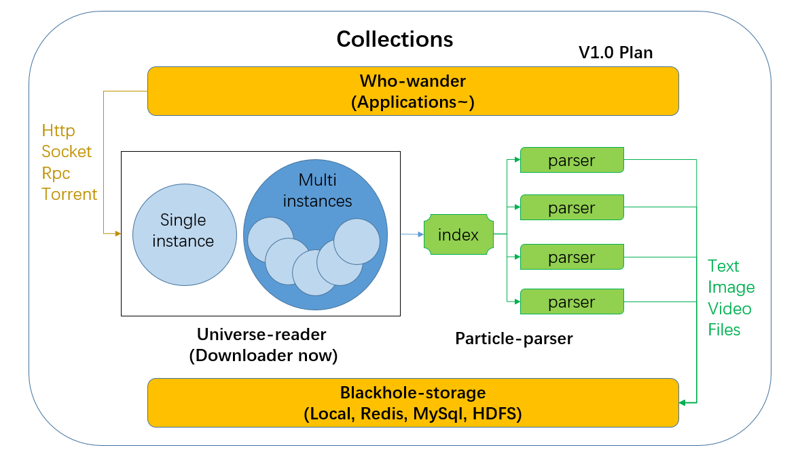

# Collections

* use HttpClient5 as http downloader
* multi-thread support
* easy use

Coming soon!

## MODELS introduction

### 1. blackhole-storage 存储器
Done:nothing  
TODO:local,redis,sql
###2. particle-parser 解析器
Done: base process;Index dispatch;split tasks  
TODO: More data Websites~
###3. universe-reader 下载器
Done: base process;Http downloader
TODO: failed-retry, so-parser(unidbg),Rpc,torrent/magnet
###4. who-wander 任务启动器
Done:base process

