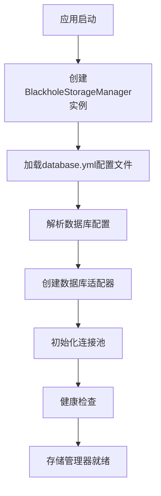
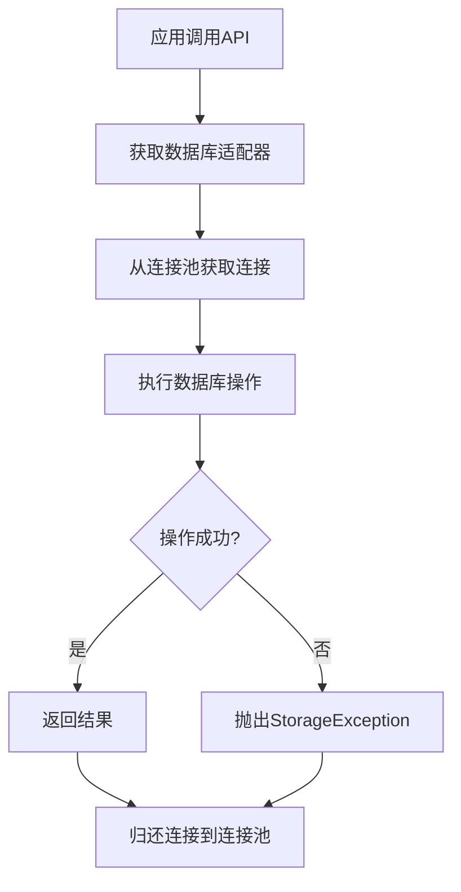
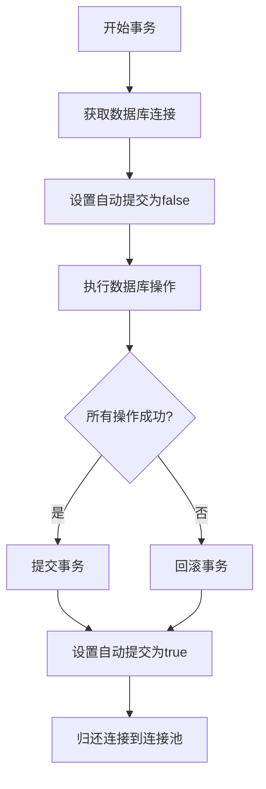

# Blackhole存储管理器 - 产品需求文档

## 1. 产品概述

Blackhole存储管理器是一个多数据库统一存储解决方案，旨在为Java应用提供简单、统一的数据库访问接口。通过抽象不同数据库的差异，开发者可以使用一致的API操作SQLite、MySQL、Redis、Hive、HBase等多种数据库。

该产品解决了多数据库环境下的以下问题：
- 不同数据库API差异大，学习成本高
- 数据库连接管理复杂，容易出现连接泄漏
- 缺乏统一的事务管理和异常处理机制
- 配置文件分散，难以统一管理

目标用户：需要同时操作多种数据库的Java应用开发者
核心价值：降低多数据库开发复杂度，提高开发效率和系统稳定性

## 2. 核心功能

### 2.1 用户角色

| 角色 | 注册方法 | 核心权限 |
|------|----------|----------|
| 应用开发者 | 无需注册，直接使用API | 使用所有数据库存储功能 |
| 系统管理员 | 无需注册，配置管理 | 配置数据库连接、监控性能 |

### 2.2 功能模块

Blackhole存储管理器包含以下核心功能模块：

1. **统一存储接口**：提供标准化的数据库操作API
2. **多数据库支持**：支持SQLite、MySQL、Redis、Hive、HBase
3. **连接池管理**：自动管理数据库连接，支持连接池配置
4. **配置管理**：集中管理所有数据库配置信息
5. **事务管理**：支持跨数据库的事务操作
6. **异常处理**：统一的异常处理机制
7. **监控统计**：提供数据库性能和连接池监控

### 2.3 页面功能

本产品是Java库，没有前端页面，主要功能通过API接口提供：

**核心API接口：**
1. 存储管理器初始化：加载配置、创建适配器
2. 数据库操作：查询、插入、更新、删除
3. 事务管理：开始、提交、回滚事务
4. 配置管理：加载、重新加载配置
5. 监控统计：获取性能和连接统计信息

**详细功能列表：**

| 模块名称 | 功能名称 | 功能描述 |
|----------|----------|----------|
| 存储管理器 | 初始化管理器 | 从配置文件初始化存储管理器，创建所有数据库适配器 |
| 存储管理器 | 获取适配器 | 根据配置名称获取特定的数据库适配器 |
| 存储管理器 | 关闭管理器 | 关闭所有数据库连接和适配器 |
| 存储管理器 | 健康检查 | 检查所有数据库连接的健康状态 |
| SQLite适配器 | 单条查询 | 执行单条SQL查询并返回结果 |
| SQLite适配器 | 多条查询 | 执行SQL查询并返回多条结果 |
| SQLite适配器 | 分页查询 | 执行分页查询并返回分页结果 |
| SQLite适配器 | 单条插入 | 执行单条数据插入操作 |
| SQLite适配器 | 批量插入 | 执行批量数据插入操作 |
| SQLite适配器 | 数据更新 | 执行数据更新操作 |
| SQLite适配器 | 数据删除 | 执行数据删除操作 |
| SQLite适配器 | 事务管理 | 支持事务的开始、提交和回滚 |
| SQLite适配器 | 统计信息 | 获取SQLite数据库文件大小和版本信息 |
| MySQL适配器 | 单条查询 | 执行单条SQL查询并返回结果 |
| MySQL适配器 | 多条查询 | 执行SQL查询并返回多条结果 |
| MySQL适配器 | 分页查询 | 执行分页查询并返回分页结果 |
| MySQL适配器 | 单条插入 | 执行单条数据插入操作 |
| MySQL适配器 | 批量插入 | 执行批量数据插入操作 |
| MySQL适配器 | 数据更新 | 执行数据更新操作 |
| MySQL适配器 | 数据删除 | 执行数据删除操作 |
| MySQL适配器 | 事务管理 | 支持事务的开始、提交和回滚 |
| MySQL适配器 | 统计信息 | 获取MySQL服务器状态和数据库统计 |
| Redis适配器 | 字符串操作 | 支持set、get、incr、decr等字符串操作 |
| Redis适配器 | 哈希操作 | 支持hset、hget、hdel等哈希操作 |
| Redis适配器 | 列表操作 | 支持lpush、rpush、lpop、rpop等列表操作 |
| Redis适配器 | 集合操作 | 支持sadd、srem、sismember等集合操作 |
| Redis适配器 | 有序集合 | 支持zadd、zrange、zrank等有序集合操作 |
| Redis适配器 | 过期管理 | 支持设置键的过期时间和TTL查询 |
| Redis适配器 | 发布订阅 | 支持发布订阅消息模式 |
| Redis适配器 | 统计信息 | 获取Redis服务器信息和连接池统计 |
| 配置管理器 | 加载配置 | 从YAML文件加载数据库配置 |
| 配置管理器 | 获取配置 | 根据名称获取特定的数据库配置 |
| 配置管理器 | 重新加载 | 重新加载配置文件 |
| 配置管理器 | 配置验证 | 验证数据库配置的完整性和有效性 |
| 连接池管理 | 连接池配置 | 配置连接池大小、超时等参数 |
| 连接池管理 | 连接监控 | 监控连接池使用情况和性能 |
| 连接池管理 | 连接回收 | 自动回收空闲和过期连接 |
| 异常处理 | 异常封装 | 统一封装数据库异常为StorageException |
| 异常处理 | 错误码管理 | 提供标准化的错误码和错误信息 |
| 异常处理 | 异常链 | 保留原始异常信息便于调试 |
| 监控统计 | 性能监控 | 监控查询执行时间和慢查询 |
| 监控统计 | 连接统计 | 统计连接池使用情况和连接数 |
| 监控统计 | 错误统计 | 统计数据库操作错误率和异常 |
| 监控统计 | 健康检查 | 定期检查数据库连接健康状态 |

## 3. 核心流程

### 3.1 应用初始化流程



### 3.2 数据库操作流程



### 3.3 事务操作流程



## 4. 用户界面设计

### 4.1 设计规范

由于Blackhole是Java库，没有图形界面，以下是API设计的规范：

**API设计原则：**
- 简洁性：提供简单易用的API接口
- 一致性：所有数据库适配器使用相同的接口
- 类型安全：使用泛型和强类型
- 异常处理：提供清晰的异常信息

**核心接口设计：**

```java
// 存储管理器接口
public interface DatabaseStorage {
    // 基本操作
    <T> T querySingle(String sql, RowMapper<T> rowMapper, Object... params);
    <T> List<T> queryMultiple(String sql, RowMapper<T> rowMapper, Object... params);
    <T> Page<T> queryPage(String sql, RowMapper<T> rowMapper, int pageNum, int pageSize);
    
    // 数据修改
    int insert(String sql, Object... params);
    int[] batchInsert(String sql, List<Object[]> params);
    int update(String sql, Object... params);
    int delete(String sql, Object... params);
    
    // 事务管理
    void beginTransaction();
    void commitTransaction();
    void rollbackTransaction();
    
    // 工具方法
    boolean isHealthy();
    String getDatabaseType();
    String getConnectionInfo();
}
```

**配置格式：**
使用YAML格式进行配置，支持环境变量和属性占位符：

```yaml
sqlite-dev:
  type: "sqlite"
  name: "sqlite-dev"
  enabled: true
  connection:
    url: "jdbc:sqlite:blackhole_dev.db"
    driver_class: "org.sqlite.JDBC"
  pool:
    max_pool_size: 10
    min_pool_size: 1
```

**异常设计：**
提供统一的异常类，包含错误码和详细信息：

```java
public class StorageException extends RuntimeException {
    private final String errorCode;
    private final Object[] params;
    
    public StorageException(String errorCode, String message, Object... params) {
        super(message);
        this.errorCode = errorCode;
        this.params = params;
    }
}
```

### 4.2 响应式设计

**API响应设计：**
- 查询操作：返回泛型结果，支持自定义RowMapper
- 分页查询：返回Page对象，包含分页信息和数据
- 修改操作：返回受影响的行数
- 批量操作：返回int数组，表示每批操作的结果

**错误响应：**
- 所有数据库异常统一封装为StorageException
- 提供错误码便于程序处理
- 保留原始异常信息便于调试

### 4.3 性能优化

**连接池优化：**
- 使用HikariCP作为默认连接池
- 支持连接池参数配置
- 自动连接验证和回收

**查询优化：**
- 支持预编译语句
- 参数化查询防止SQL注入
- 慢查询日志记录

**缓存策略：**
- 适配器实例缓存
- 连接池复用
- 配置信息缓存

## 5. 技术约束

### 5.1 技术要求

**Java版本：** Java 8或更高版本

**依赖库：**
- SQLite：sqlite-jdbc
- MySQL：mysql-connector-java
- Redis：jedis
- Hive：hive-jdbc
- HBase：hbase-client
- 连接池：HikariCP
- 配置：Jackson

### 5.2 部署约束

**环境要求：**
- 支持Windows、Linux、macOS操作系统
- 需要对应的数据库服务运行
- 配置文件必须存在且格式正确

**资源限制：**
- 连接池大小可配置
- 查询超时时间可配置
- 内存使用与连接池大小成正比

### 5.3 安全要求

**配置安全：**
- 数据库密码支持加密存储
- 配置文件权限控制
- 敏感信息不记录到日志

**连接安全：**
- 支持SSL连接
- 连接字符串参数化
- 防止SQL注入攻击

## 6. 测试要求

### 6.1 功能测试

**单元测试：**
- 每个数据库适配器的CRUD操作
- 事务管理功能
- 异常处理机制
- 配置加载和验证

**集成测试：**
- 多数据库同时操作
- 连接池管理
- 性能基准测试
- 并发访问测试

### 6.2 性能测试

**基准测试：**
- 单数据库操作性能
- 批量操作性能
- 分页查询性能
- 事务处理性能

**压力测试：**
- 高并发连接测试
- 长时间运行稳定性
- 内存泄漏检测
- 连接池耗尽处理

### 6.3 兼容性测试

**数据库版本：**
- SQLite 3.x
- MySQL 5.7+
- Redis 3.0+
- Hive 2.x
- HBase 1.x+

**Java版本：**
- Java 8
- Java 11
- Java 17

## 7. 交付物

### 7.1 代码交付

**核心代码：**
- 存储管理器核心类
- 数据库适配器实现
- 配置管理器
- 异常处理类

**示例代码：**
- SQLite使用示例
- MySQL使用示例
- Redis使用示例
- 快速入门示例

### 7.2 文档交付

**技术文档：**
- API文档（JavaDoc）
- 配置说明文档
- 使用示例文档
- 部署指南

**用户文档：**
- 快速入门指南
- 最佳实践文档
- 故障排除指南

### 7.3 测试交付

**测试代码：**
- 单元测试代码
- 集成测试代码
- 性能测试代码

**测试报告：**
- 功能测试报告
- 性能测试报告
- 兼容性测试报告

## 8. 项目里程碑

### 8.1 第一阶段（核心功能）
- [x] SQLite适配器实现
- [x] MySQL适配器实现  
- [x] Redis适配器实现
- [x] 配置管理器实现
- [x] 存储管理器核心实现
- [x] 基础异常处理

### 8.2 第二阶段（高级功能）
- [ ] Hive适配器实现
- [ ] HBase适配器实现
- [ ] 高级事务管理
- [ ] 性能监控功能
- [ ] 完整的单元测试

### 8.3 第三阶段（优化完善）
- [ ] 性能优化
- [ ] 安全增强
- [ ] 文档完善
- [ ] 示例代码
- [ ] 部署工具

## 9. 风险评估

### 9.1 技术风险

**数据库兼容性：**
- 不同版本数据库的API差异
- 解决方案：使用标准API，提供版本适配层

**性能问题：**
- 连接池配置不当可能导致性能问题
- 解决方案：提供默认配置和性能调优指南

### 9.2 项目风险

**开发时间：**
- 多数据库适配器开发工作量大
- 缓解措施：分阶段实施，优先实现核心数据库

**测试复杂性：**
- 需要测试多种数据库组合
- 缓解措施：使用Docker容器化测试环境

### 9.3 维护风险

**依赖更新：**
- 第三方数据库驱动更新可能引入兼容性问题
- 解决方案：定期更新依赖，建立自动化测试

**文档维护：**
- API文档需要与实际代码保持同步
- 解决方案：使用JavaDoc自动生成文档