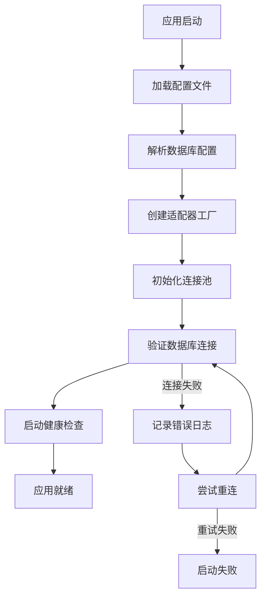
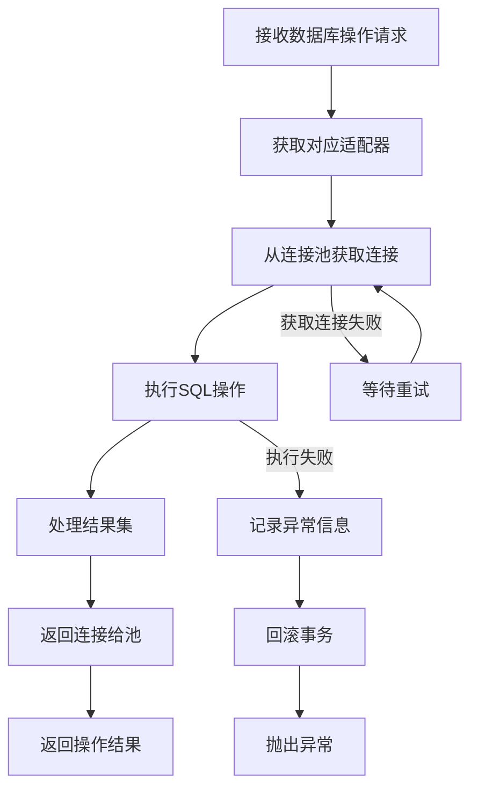
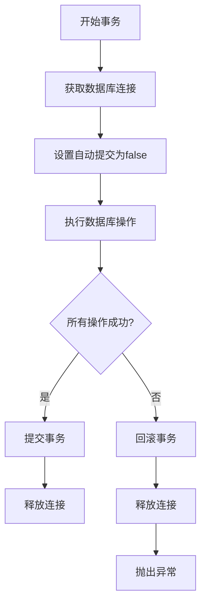
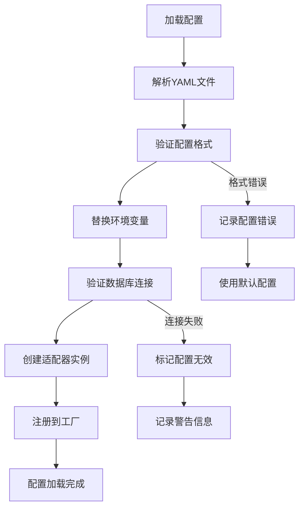

# Blackhole存储管理器 - 产品需求文档

## 1. 产品概述

Blackhole存储管理器是一个统一的多数据库访问中间件，为Java应用提供标准化的数据库操作接口。通过统一的API封装，开发者可以轻松地在不同数据库类型之间切换，无需关心底层数据库的具体实现细节。

该产品主要解决以下问题：
- 多数据库环境下的开发复杂性
- 数据库连接池管理和优化
- 跨数据库的SQL语法差异
- 事务管理的统一处理
- 数据库性能监控和调优

目标用户群体包括Java开发者、系统架构师和运维团队，帮助他们快速构建可扩展、高性能的数据访问层。

## 2. 核心功能

### 2.1 用户角色

| 角色 | 注册方法 | 核心权限 |
|------|----------|----------|
| 开发者 | 无需注册 | 使用API进行数据库操作、配置数据库连接 |
| 系统管理员 | 系统配置 | 管理数据库配置、监控数据库状态、调优性能 |
| 运维人员 | 系统授权 | 部署和配置存储管理器、查看运行日志 |

### 2.2 功能模块

Blackhole存储管理器包含以下核心功能模块：

1. **统一存储接口**：提供标准化的数据库操作API，支持CRUD操作
2. **多数据库支持**：内置SQLite、MySQL、Redis、Hive、HBase五种数据库适配器
3. **连接池管理**：智能连接池管理，自动优化连接使用
4. **配置管理**：灵活的YAML配置文件，支持多环境配置
5. **事务管理**：统一的事务处理机制，支持跨数据库事务
6. **异常处理**：统一的异常体系，提供详细的错误信息
7. **监控管理**：实时监控数据库连接状态和性能指标

### 2.3 页面详情

| 页面名称 | 模块名称 | 功能描述 |
|----------|----------|----------|
| 存储管理器主页面 | 适配器管理 | 显示所有已配置的数据库适配器，提供创建、删除、修改适配器的功能 |
| 存储管理器主页面 | 连接监控 | 实时监控各数据库连接池状态，显示活跃连接数、空闲连接数、连接等待时间 |
| 存储管理器主页面 | 性能监控 | 展示数据库查询性能指标，包括平均查询时间、慢查询统计、错误率 |
| 配置管理页面 | 数据库配置 | 管理数据库连接配置，支持添加、编辑、删除数据库配置，提供配置验证功能 |
| 配置管理页面 | 连接池配置 | 配置连接池参数，包括最大连接数、最小连接数、超时时间等 |
| 配置管理页面 | 全局设置 | 管理全局配置，如健康检查间隔、慢查询阈值、重试策略等 |
| 操作日志页面 | 查询日志 | 查看数据库操作日志，支持按时间、数据库类型、操作类型筛选 |
| 操作日志页面 | 错误日志 | 查看错误日志，提供错误详情和解决方案建议 |
| 操作日志页面 | 性能日志 | 查看性能相关日志，包括慢查询日志和性能警告 |
| 系统状态页面 | 系统概览 | 显示系统整体运行状态，包括适配器数量、连接总数、查询总数 |
| 系统状态页面 | 资源使用 | 监控系统资源使用情况，包括内存使用、线程数、文件句柄数 |
| 系统状态页面 | 健康检查 | 执行系统健康检查，显示各组件健康状态 |

## 3. 核心流程

### 3.1 应用初始化流程



### 3.2 数据库操作流程



### 3.3 事务操作流程



### 3.4 配置管理流程



## 4. 用户界面设计

### 4.1 设计规范

**色彩方案：**
- 主色调：深蓝色 (#1E3A8A) - 代表稳定性和专业性
- 辅助色：浅蓝色 (#3B82F6) - 用于强调和交互元素
- 成功色：绿色 (#10B981) - 表示成功状态
- 警告色：橙色 (#F59E0B) - 表示警告信息
- 错误色：红色 (#EF4444) - 表示错误状态
- 背景色：浅灰色 (#F9FAFB) - 提供良好的对比度

**字体规范：**
- 标题字体：思源黑体，24px，加粗
- 正文字体：思源黑体，14px，常规
- 小字体：思源黑体，12px，用于辅助信息
- 代码字体：Consolas，13px，等宽字体

**布局风格：**
- 采用卡片式布局，每个功能模块独立成卡片
- 左侧导航栏，右侧内容区域
- 响应式设计，支持不同屏幕尺寸
- 使用阴影和圆角增强视觉层次

**交互元素：**
- 按钮：圆角矩形，悬停时有轻微阴影效果
- 输入框：边框清晰，聚焦时边框变色
- 表格：斑马纹样式，悬停高亮
- 图表：使用现代扁平化设计风格

### 4.2 页面设计详情

**存储管理器主页面：**
- 顶部显示系统标题和当前时间
- 左侧导航栏包含主要功能模块入口
- 中央区域显示适配器状态概览卡片
- 底部显示系统资源使用情况
- 右上角提供快速操作按钮（刷新、导出、设置）

**配置管理页面：**
- 左侧树形结构显示配置分类
- 右侧表单区域显示详细配置项
- 顶部提供配置操作工具栏（新增、删除、导入、导出）
- 底部显示配置验证结果和提示信息

**监控页面：**
- 顶部显示关键性能指标（KPI）
- 中央区域使用图表展示性能趋势
- 底部表格显示详细的监控数据
- 提供时间范围选择器和刷新频率设置

**日志页面：**
- 顶部搜索栏支持多条件筛选
- 中央列表显示日志条目
- 点击日志条目可查看详细信息
- 支持日志导出和清理功能

### 4.3 响应式设计

**桌面端（>1200px）：**
- 完整显示所有功能模块
- 多列布局展示数据
- 图表使用完整尺寸
- 导航栏始终显示

**平板端（768px-1200px）：**
- 导航栏可收起/展开
- 表格采用水平滚动
- 图表自适应容器宽度
- 操作按钮适当缩小

**手机端（<768px）：**
- 使用汉堡菜单
- 单列布局
- 简化图表显示
- 触摸友好的交互元素
- 重要信息优先显示

## 5. 性能需求

### 5.1 响应时间要求

| 操作类型 | 目标响应时间 | 最大响应时间 |
|----------|-------------|-------------|
| 简单查询（单条记录） | < 50ms | 200ms |
| 复杂查询（多条记录） | < 200ms | 1000ms |
| 插入操作（单条记录） | < 100ms | 500ms |
| 批量插入（100条记录） | < 500ms | 2000ms |
| 更新操作 | < 100ms | 500ms |
| 删除操作 | < 100ms | 500ms |
| 事务提交 | < 200ms | 1000ms |

### 5.2 并发处理能力

| 数据库类型 | 最大并发连接数 | 推荐并发数 |
|------------|---------------|------------|
| SQLite | 10 | 5 |
| MySQL | 100 | 50 |
| Redis | 500 | 200 |
| Hive | 20 | 10 |
| HBase | 200 | 100 |

### 5.3 资源使用限制

| 资源类型 | 最大使用量 | 推荐配置 |
|----------|-----------|----------|
| 内存使用 | 2GB | 1GB |
| 线程数 | 200 | 100 |
| 文件句柄 | 10000 | 5000 |
| 数据库连接池 | 500 | 200 |

## 6. 兼容性需求

### 6.1 数据库版本支持

| 数据库 | 最低版本 | 推荐版本 | 测试版本 |
|--------|----------|----------|----------|
| SQLite | 3.25.0 | 3.40.0+ | 3.40.1 |
| MySQL | 5.7 | 8.0+ | 8.0.33 |
| Redis | 4.0 | 6.0+ | 7.0.11 |
| Hive | 2.3 | 3.1+ | 3.1.3 |
| HBase | 2.0 | 2.4+ | 2.5.5 |

### 6.2 运行环境要求

| 环境类型 | 最低要求 | 推荐配置 |
|----------|----------|----------|
| Java版本 | 8 | 11+ |
| Maven版本 | 3.6 | 3.8+ |
| 操作系统 | Windows 10, Linux, macOS | 最新稳定版 |
| 内存要求 | 512MB | 2GB+ |
| 磁盘空间 | 100MB | 1GB+ |

### 6.3 依赖兼容性

| 依赖库 | 版本范围 | 推荐版本 |
|--------|----------|----------|
| HikariCP | 4.0.0 - 5.0.x | 5.0.1 |
| Jedis | 4.0.0 - 4.4.x | 4.4.3 |
| Jackson | 2.13.0 - 2.15.x | 2.15.2 |
| SLF4J | 2.0.0 - 2.0.x | 2.0.7 |

## 7. 测试需求

### 7.1 功能测试

**单元测试覆盖率：**
- 核心业务逻辑：≥ 90%
- 数据库适配器：≥ 85%
- 配置管理：≥ 80%
- 异常处理：≥ 95%

**集成测试场景：**
- 多数据库并发操作
- 事务管理和回滚
- 配置热加载
- 连接池故障恢复
- 性能压力测试

### 7.2 性能测试

**基准测试指标：**
- 单数据库类型QPS：≥ 1000
- 多数据库类型QPS：≥ 500
- 99分位响应时间：≤ 500ms
- 内存使用率：≤ 80%
- CPU使用率：≤ 70%

**压力测试场景：**
- 高并发查询测试
- 大数据量插入测试
- 长时间运行稳定性测试
- 内存泄漏检测
- 连接池耗尽测试

### 7.3 兼容性测试

**数据库兼容性：**
- 不同版本数据库连接测试
- SQL语法兼容性验证
- 数据类型转换测试
- 字符编码测试

**环境兼容性：**
- 不同操作系统测试
- 不同Java版本测试
- 不同网络环境测试
- 容器化部署测试

## 8. 部署需求

### 8.1 部署要求

**单机部署：**
- 支持独立JAR包部署
- 支持Docker容器部署
- 支持systemd服务管理
- 支持Windows服务安装

**集群部署：**
- 支持负载均衡
- 支持配置中心集成
- 支持服务发现
- 支持健康检查

### 8.2 配置管理

**配置文件位置：**
- 默认位置：classpath:database.yml
- 自定义位置：通过系统属性指定
- 环境变量：支持环境变量覆盖
- 配置中心：支持Apollo、Nacos等

**配置热更新：**
- 支持配置文件修改自动加载
- 支持配置验证和回滚
- 支持配置版本管理
- 支持灰度发布

### 8.3 监控告警

**监控指标：**
- 数据库连接数
- 查询响应时间
- 错误率和异常统计
- 系统资源使用
- 业务指标统计

**告警规则：**
- 连接池耗尽告警
- 查询超时告警
- 错误率过高告警
- 系统资源告警
- 数据库不可用告警

## 9. 维护需求

### 9.1 日志管理

**日志级别：**
- ERROR：系统错误和异常
- WARN：警告信息和潜在问题
- INFO：重要操作和状态变更
- DEBUG：详细调试信息
- TRACE：最详细的执行流程

**日志格式：**
```
[时间戳] [线程名] [日志级别] [类名] - [消息内容]
示例：
[2024-01-15 10:30:45.123] [main] [INFO] [SQLiteAdapter] - 成功初始化SQLite适配器，数据库文件：/data/app.db
```

**日志轮转：**
- 按日期轮转
- 按文件大小轮转
- 保留策略配置
- 压缩归档支持

### 9.2 升级维护

**版本管理：**
- 语义化版本号（主版本.次版本.修订版本）
- 向后兼容性保证
- 升级脚本和工具
- 版本迁移指南

**热升级支持：**
- 配置热加载
- 适配器动态替换
- 零停机升级
- 回滚机制

### 9.3 故障处理

**故障分类：**
- 配置错误：提供详细的错误信息和修复建议
- 连接失败：自动重连和降级策略
- 查询错误：SQL语法检查和优化建议
- 系统错误：异常捕获和恢复机制

**故障恢复：**
- 自动重试机制
- 降级服务
- 熔断保护
- 手动恢复工具

这个详细的产品需求文档为Blackhole存储管理器提供了全面的功能规格说明，涵盖了从核心功能到部署维护的各个方面，为开发团队提供了清晰的实现指导。