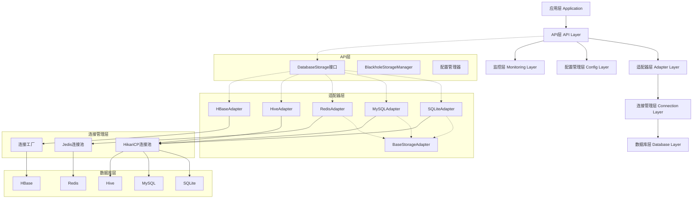
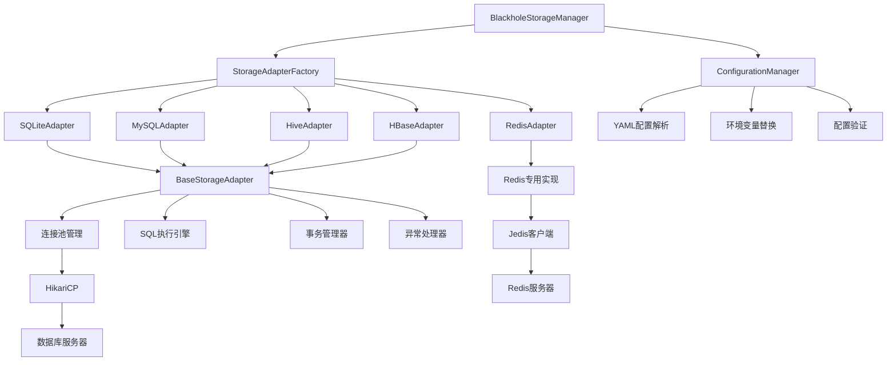
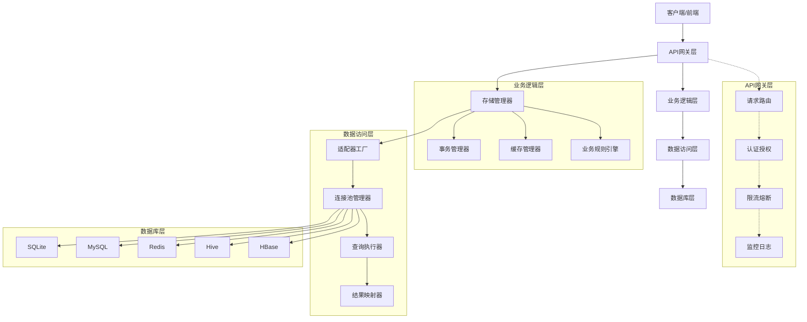
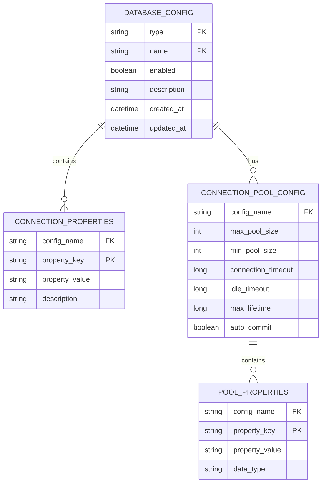
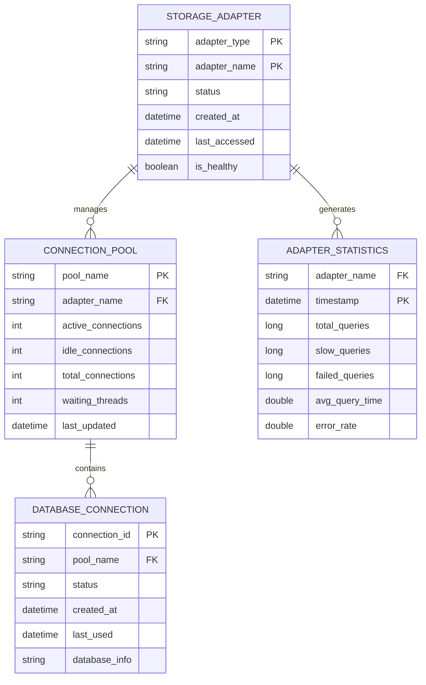
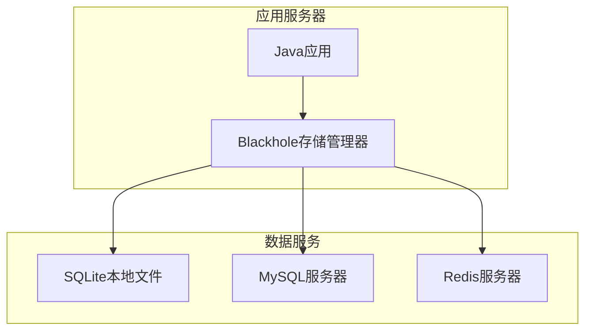
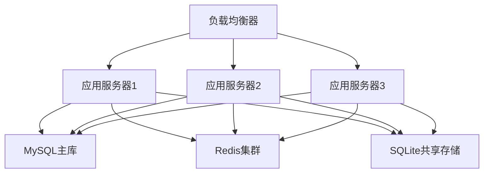

# Blackhole存储管理器 - 技术架构文档

## 1. 架构设计

### 1.1 整体架构

Blackhole存储管理器采用分层架构设计，从上至下分为：
- **API层**：提供统一的数据库操作接口
- **适配器层**：封装不同数据库的特定实现
- **连接管理层**：管理数据库连接池
- **配置管理层**：处理配置文件加载和解析
- **监控层**：提供性能和连接监控



### 1.2 核心组件架构



## 2. 技术描述

### 2.1 核心技术栈

**基础框架：**
- 编程语言：Java 8+
- 构建工具：Maven 3.6+
- 项目结构：多模块Maven项目

**数据库支持：**
- SQLite：sqlite-jdbc 3.40.1.0
- MySQL：mysql-connector-java 8.0.33
- Redis：jedis 4.4.3
- Hive：hive-jdbc 3.1.3
- HBase：hbase-client 2.5.5

**连接池技术：**
- HikariCP 5.0.1（用于关系型数据库）
- Jedis内置连接池（用于Redis）

**配置管理：**
- Jackson 2.15.2（YAML解析）
- 支持环境变量替换
- 配置验证和缓存

**监控和日志：**
- SLF4J 2.0.7（日志抽象）
- 内置性能监控
- JMX支持（可选）

**测试框架：**
- JUnit 5.9.3
- Mockito 5.3.1
- Testcontainers 1.18.3（集成测试）

### 2.2 项目初始化

**Maven坐标：**
```xml
<groupId>com.collections</groupId>
<artifactId>blackhole-storager</artifactId>
<version>1.0.0</version>
```

**依赖管理：**
```xml
<dependencies>
    <!-- 数据库驱动 -->
    <dependency>
        <groupId>org.xerial</groupId>
        <artifactId>sqlite-jdbc</artifactId>
        <version>3.40.1.0</version>
    </dependency>
    
    <dependency>
        <groupId>mysql</groupId>
        <artifactId>mysql-connector-java</artifactId>
        <version>8.0.33</version>
    </dependency>
    
    <dependency>
        <groupId>redis.clients</groupId>
        <artifactId>jedis</artifactId>
        <version>4.4.3</version>
    </dependency>
    
    <!-- 连接池 -->
    <dependency>
        <groupId>com.zaxxer</groupId>
        <artifactId>HikariCP</artifactId>
        <version>5.0.1</version>
    </dependency>
    
    <!-- 配置管理 -->
    <dependency>
        <groupId>com.fasterxml.jackson.dataformat</groupId>
        <artifactId>jackson-dataformat-yaml</artifactId>
        <version>2.15.2</version>
    </dependency>
    
    <!-- 日志 -->
    <dependency>
        <groupId>org.slf4j</groupId>
        <artifactId>slf4j-api</artifactId>
        <version>2.0.7</version>
    </dependency>
</dependencies>
```

## 3. 路由定义

### 3.1 核心类和方法路由

**存储管理器核心方法：**

| 方法签名 | 用途 | 参数说明 |
|----------|------|----------|
| `getInstance()` | 获取单例实例 | 无参数 |
| `initializeFromClasspath(String configFile)` | 从classpath初始化 | configFile: 配置文件名 |
| `initializeFromFile(String configPath)` | 从文件系统初始化 | configPath: 配置文件路径 |
| `getSQLiteAdapter(String name)` | 获取SQLite适配器 | name: 配置名称 |
| `getMySQLAdapter(String name)` | 获取MySQL适配器 | name: 配置名称 |
| `getRedisAdapter(String name)` | 获取Redis适配器 | name: 配置名称 |
| `getDefaultAdapter()` | 获取默认适配器 | 无参数 |
| `shutdown()` | 关闭所有适配器 | 无参数 |

**数据库操作核心方法：**

| 方法签名 | 用途 | 参数说明 |
|----------|------|----------|
| `<T> T querySingle(String sql, RowMapper<T> mapper, Object... params)` | 单条查询 | sql: SQL语句, mapper: 结果映射器, params: 参数 |
| `<T> List<T> queryMultiple(String sql, RowMapper<T> mapper, Object... params)` | 多条查询 | sql: SQL语句, mapper: 结果映射器, params: 参数 |
| `<T> Page<T> queryPage(String sql, RowMapper<T> mapper, int pageNum, int pageSize)` | 分页查询 | sql: SQL语句, mapper: 结果映射器, pageNum: 页码, pageSize: 每页大小 |
| `int insert(String sql, Object... params)` | 单条插入 | sql: SQL语句, params: 参数 |
| `int[] batchInsert(String sql, List<Object[]> params)` | 批量插入 | sql: SQL语句, params: 参数列表 |
| `int update(String sql, Object... params)` | 更新操作 | sql: SQL语句, params: 参数 |
| `int delete(String sql, Object... params)` | 删除操作 | sql: SQL语句, params: 参数 |
| `void beginTransaction()` | 开始事务 | 无参数 |
| `void commitTransaction()` | 提交事务 | 无参数 |
| `void rollbackTransaction()` | 回滚事务 | 无参数 |

### 3.2 配置管理路由

**配置管理器方法：**

| 方法签名 | 用途 | 参数说明 |
|----------|------|----------|
| `loadFromClasspath(String configFile)` | 从classpath加载配置 | configFile: 配置文件名 |
| `loadFromFile(String configPath)` | 从文件系统加载配置 | configPath: 配置文件路径 |
| `getConfiguration(String name)` | 获取特定配置 | name: 配置名称 |
| `getDefaultConfiguration()` | 获取默认配置 | 无参数 |
| `getAllConfigurations()` | 获取所有配置 | 无参数 |
| `reload()` | 重新加载配置 | 无参数 |
| `validate()` | 验证配置 | 无参数 |

## 4. API定义

### 4.1 核心接口定义

**DatabaseStorage接口：**
```java
public interface DatabaseStorage {
    // 查询操作
    <T> T querySingle(String sql, RowMapper<T> rowMapper, Object... params) throws StorageException;
    <T> List<T> queryMultiple(String sql, RowMapper<T> rowMapper, Object... params) throws StorageException;
    <T> Page<T> queryPage(String sql, RowMapper<T> rowMapper, int pageNum, int pageSize) throws StorageException;
    
    // 插入操作
    int insert(String sql, Object... params) throws StorageException;
    int[] batchInsert(String sql, List<Object[]> params) throws StorageException;
    
    // 更新和删除
    int update(String sql, Object... params) throws StorageException;
    int delete(String sql, Object... params) throws StorageException;
    
    // 事务管理
    void beginTransaction() throws StorageException;
    void commitTransaction() throws StorageException;
    void rollbackTransaction() throws StorageException;
    
    // 工具方法
    boolean isHealthy();
    String getDatabaseType();
    String getConnectionInfo();
}
```

**RowMapper函数式接口：**
```java
@FunctionalInterface
public interface RowMapper<T> {
    T mapRow(ResultSet rs, int rowNum) throws SQLException;
}
```

**Page分页类：**
```java
public class Page<T> {
    private List<T> content;
    private int pageNumber;
    private int pageSize;
    private long totalElements;
    private int totalPages;
    
    // 构造函数、getter、setter方法
    public boolean hasNext() { return pageNumber < totalPages; }
    public boolean hasPrevious() { return pageNumber > 1; }
    public boolean isFirst() { return pageNumber == 1; }
    public boolean isLast() { return pageNumber == totalPages; }
    public boolean isEmpty() { return content == null || content.isEmpty(); }
}
```

### 4.2 配置类定义

**DatabaseConfig类：**
```java
public class DatabaseConfig {
    private String type;
    private String name;
    private boolean enabled;
    private Map<String, String> connection;
    private ConnectionPoolConfig pool;
    
    // 构造函数、getter、setter方法
    public void validate() throws StorageException;
    public String getProperty(String key, String defaultValue);
}
```

**ConnectionPoolConfig类：**
```java
public class ConnectionPoolConfig {
    private int maxPoolSize = 10;
    private int minPoolSize = 1;
    private long connectionTimeout = 30000;
    private long idleTimeout = 600000;
    private long maxLifetime = 1800000;
    private long leakDetectionThreshold = 60000;
    private String connectionTestQuery = "SELECT 1";
    private boolean autoCommit = false;
    
    // 构造函数、getter、setter方法
    public void validate() throws StorageException;
    public static ConnectionPoolConfig defaultConfig();
    public static ConnectionPoolConfig highPerformance();
    public static ConnectionPoolConfig lowResource();
}
```

### 4.3 异常定义

**StorageException类：**
```java
public class StorageException extends RuntimeException {
    private final String errorCode;
    private final Object[] params;
    
    public StorageException(String errorCode, String message, Object... params) {
        super(message);
        this.errorCode = errorCode;
        this.params = params;
    }
    
    public StorageException(String errorCode, String message, Throwable cause, Object... params) {
        super(message, cause);
        this.errorCode = errorCode;
        this.params = params;
    }
    
    public String getErrorCode() { return errorCode; }
    public Object[] getParams() { return params; }
    public String getFormattedMessage() { /* 格式化错误信息 */ }
}
```

## 5. 服务器架构设计

### 5.1 分层架构



### 5.2 组件职责

**API网关层：**
- 统一请求入口和路由
- 认证授权验证
- 限流熔断保护
- 请求响应日志记录

**业务逻辑层：**
- 存储管理器核心业务逻辑
- 事务管理和协调
- 缓存策略管理
- 业务规则执行

**数据访问层：**
- 适配器实例创建和管理
- 连接池生命周期管理
- SQL查询执行和优化
- 结果集映射和转换

**数据库层：**
- 多种数据库类型支持
- 数据持久化存储
- 索引和查询优化
- 数据备份和恢复

### 5.3 高可用设计

**容错机制：**
- 连接池健康检查
- 数据库连接重试
- 熔断器模式
- 降级策略

**监控告警：**
- 实时性能监控
- 异常日志收集
- 健康状态检查
- 自动故障恢复

**扩展性设计：**
- 水平扩展支持
- 负载均衡策略
- 数据分片方案
- 缓存集群支持

## 6. 数据模型

### 6.1 配置数据模型



### 6.2 运行时数据模型



### 6.3 数据库表结构定义

**SQLite示例表结构：**
```sql
-- 用户表
CREATE TABLE users (
    id INTEGER PRIMARY KEY AUTOINCREMENT,
    username VARCHAR(50) UNIQUE NOT NULL,
    email VARCHAR(100) UNIQUE NOT NULL,
    password_hash VARCHAR(255) NOT NULL,
    created_at TIMESTAMP DEFAULT CURRENT_TIMESTAMP,
    updated_at TIMESTAMP DEFAULT CURRENT_TIMESTAMP
);

-- 创建索引
CREATE INDEX idx_users_username ON users(username);
CREATE INDEX idx_users_email ON users(email);
CREATE INDEX idx_users_created_at ON users(created_at);
```

**MySQL示例表结构：**
```sql
-- 产品表
CREATE TABLE products (
    id BIGINT AUTO_INCREMENT PRIMARY KEY,
    name VARCHAR(200) NOT NULL,
    category VARCHAR(100) NOT NULL,
    price DECIMAL(10,2) NOT NULL,
    stock INT DEFAULT 0,
    description TEXT,
    created_at TIMESTAMP DEFAULT CURRENT_TIMESTAMP,
    updated_at TIMESTAMP DEFAULT CURRENT_TIMESTAMP ON UPDATE CURRENT_TIMESTAMP,
    
    INDEX idx_category (category),
    INDEX idx_name (name),
    INDEX idx_price (price),
    INDEX idx_created_at (created_at)
) ENGINE=InnoDB DEFAULT CHARSET=utf8mb4 COLLATE=utf8mb4_unicode_ci;
```

**Redis数据结构示例：**
```
# 字符串类型
user:1001:name = "张三"
user:1001:email = "zhangsan@example.com"
user:1001:score = "95.5"

# 哈希类型
user:1001:profile = {
    "name": "张三",
    "age": "25",
    "city": "北京",
    "department": "技术部"
}

# 列表类型
recent:users = ["user:1004", "user:1003", "user:1002", "user:1001"]
task:queue = ["task:001", "task:002", "task:003", "task:004"]

# 集合类型
tags:tech = {"technology", "programming", "software", "hardware"}
users:active = {"user:1001", "user:1002", "user:1003", "user:1004"}

# 有序集合
leaderboard:game:scores = {
    "player:david": 2000,
    "player:alice": 1800,
    "player:bob": 1500,
    "player:eve": 1200,
    "player:charlie": 800
}
```

### 6.4 数据访问层设计

**数据访问对象（DAO）模式：**
```java
public abstract class BaseDao<T, ID> {
    protected final DatabaseStorage storage;
    protected final String tableName;
    protected final RowMapper<T> rowMapper;
    
    public BaseDao(DatabaseStorage storage, String tableName, RowMapper<T> rowMapper) {
        this.storage = storage;
        this.tableName = tableName;
        this.rowMapper = rowMapper;
    }
    
    public abstract T findById(ID id);
    public abstract List<T> findAll();
    public abstract T save(T entity);
    public abstract void deleteById(ID id);
    public abstract boolean existsById(ID id);
    public abstract long count();
}
```

**实体类示例：**
```java
public class User {
    private Long id;
    private String username;
    private String email;
    private String passwordHash;
    private LocalDateTime createdAt;
    private LocalDateTime updatedAt;
    
    // 构造函数、getter、setter方法
}

public class Product {
    private Long id;
    private String name;
    private String category;
    private BigDecimal price;
    private Integer stock;
    private String description;
    private LocalDateTime createdAt;
    private LocalDateTime updatedAt;
    
    // 构造函数、getter、setter方法
}
```

## 7. 性能优化策略

### 7.1 连接池优化

**HikariCP配置优化：**
```yaml
pool:
  max_pool_size: 20                    # 最大连接数
  min_pool_size: 5                     # 最小连接数
  connection_timeout: 30000           # 连接超时时间
  idle_timeout: 600000                # 空闲超时时间
  max_lifetime: 1800000               # 连接最大生命周期
  leak_detection_threshold: 60000     # 连接泄漏检测阈值
  connection_test_query: "SELECT 1"   # 连接测试查询
```

**Jedis连接池优化：**
```yaml
pool:
  max_total: 20                        # 最大连接数
  max_idle: 10                        # 最大空闲连接数
  min_idle: 5                         # 最小空闲连接数
  max_wait_millis: 3000               # 最大等待时间
  test_on_borrow: true                # 借用时测试
  test_on_return: true                # 归还时测试
  test_while_idle: true               # 空闲时测试
```

### 7.2 查询优化

**SQL优化策略：**
- 使用预编译语句（PreparedStatement）
- 合理使用索引
- 避免全表扫描
- 优化复杂查询
- 使用批量操作

**缓存策略：**
- 适配器实例缓存
- 频繁查询结果缓存
- 配置信息缓存
- 连接池复用

### 7.3 监控和调优

**性能监控指标：**
- 查询执行时间
- 连接池使用情况
- 错误率和异常统计
- 内存使用情况
- 线程池状态

**调优工具：**
- JMX监控
- 日志分析
- 性能剖析
- 压力测试

## 8. 安全设计

### 8.1 配置安全

**敏感信息保护：**
```yaml
# 使用环境变量
mysql-prod:
  connection:
    username: "${MYSQL_USER:default_user}"
    password: "${MYSQL_PASSWORD}"
    
# 配置加密
encryption:
  enabled: true
  algorithm: "AES"
  key: "${ENCRYPTION_KEY}"
```

**访问控制：**
- 配置文件权限控制
- 数据库连接权限最小化
- 操作审计日志
- 敏感操作二次验证

### 8.2 连接安全

**SSL/TLS配置：**
```yaml
connection:
  url: "jdbc:mysql://host:3306/db?useSSL=true&requireSSL=true"
  properties:
    ssl: "true"
    verifyServerCertificate: "true"
    clientCertificateKeyStoreUrl: "file:client-keystore.jks"
    clientCertificateKeyStorePassword: "${KEYSTORE_PASSWORD}"
```

**认证和授权：**
- 数据库用户权限管理
- 连接字符串参数化
- SQL注入防护
- 输入验证和清理

### 8.3 数据安全

**数据加密：**
- 传输层加密（SSL/TLS）
- 存储层加密（数据库级）
- 应用层加密（敏感字段）
- 密钥管理（KMS/HSM）

**数据脱敏：**
- 日志脱敏
- 查询结果脱敏
- 配置信息脱敏
- 错误信息脱敏

## 9. 部署架构

### 9.1 单机部署



### 9.2 集群部署



### 9.3 容器化部署

**Dockerfile示例：**
```dockerfile
FROM openjdk:11-jre-slim

COPY target/blackhole-storager-1.0.0.jar app.jar
COPY config/database.yml /config/database.yml

ENV JAVA_OPTS="-Xms512m -Xmx1024m"
ENV SPRING_PROFILES_ACTIVE=prod

EXPOSE 8080

ENTRYPOINT ["java", "-jar", "/app.jar"]
```

**Docker Compose配置：**
```yaml
version: '3.8'
services:
  app:
    build: .
    ports:
      - "8080:8080"
    environment:
      - MYSQL_HOST=mysql
      - REDIS_HOST=redis
    depends_on:
      - mysql
      - redis
    volumes:
      - ./data:/data
      - ./config:/config
      
  mysql:
    image: mysql:8.0
    environment:
      MYSQL_ROOT_PASSWORD: root_password
      MYSQL_DATABASE: blackhole
    ports:
      - "3306:3306"
    volumes:
      - mysql_data:/var/lib/mysql
      
  redis:
    image: redis:7-alpine
    ports:
      - "6379:6379"
    volumes:
      - redis_data:/data

volumes:
  mysql_data:
  redis_data:
```

## 10. 扩展性设计

### 10.1 插件架构

**适配器插件接口：**
```java
public interface StorageAdapterPlugin {
    String getAdapterType();
    DatabaseStorage createAdapter(DatabaseConfig config);
    boolean supports(DatabaseConfig config);
    void initialize(Map<String, Object> properties);
    void shutdown();
}
```

**插件加载机制：**
```java
public class PluginManager {
    private final Map<String, StorageAdapterPlugin> plugins = new HashMap<>();
    
    public void loadPlugin(String pluginClassName) {
        // 使用SPI机制加载插件
        ServiceLoader<StorageAdapterPlugin> loader = 
            ServiceLoader.load(StorageAdapterPlugin.class);
        
        for (StorageAdapterPlugin plugin : loader) {
            plugins.put(plugin.getAdapterType(), plugin);
        }
    }
    
    public DatabaseStorage createAdapter(DatabaseConfig config) {
        StorageAdapterPlugin plugin = plugins.get(config.getType());
        if (plugin != null && plugin.supports(config)) {
            return plugin.createAdapter(config);
        }
        throw new StorageException("UNSUPPORTED_DATABASE", 
            "不支持的数据库类型: " + config.getType());
    }
}
```

### 10.2 配置扩展

**动态配置更新：**
```java
public interface ConfigurationProvider {
    DatabaseConfig getConfiguration(String name);
    void addConfigurationListener(ConfigurationListener listener);
    void reload();
}

public interface ConfigurationListener {
    void onConfigurationChanged(String name, DatabaseConfig newConfig);
    void onConfigurationRemoved(String name);
}
```

**外部配置源：**
- 数据库配置表
- 配置中心（Apollo、Nacos）
- 环境变量
- 系统属性
- 远程配置服务

### 10.3 监控扩展

**指标收集接口：**
```java
public interface MetricsCollector {
    void recordQueryExecution(String adapterName, long duration, boolean success);
    void recordConnectionPoolStatus(String poolName, int active, int idle, int total);
    void recordError(String adapterName, String errorCode, String errorMessage);
    void recordTransaction(String adapterName, long duration, boolean committed);
}
```

**监控集成：**
- Micrometer指标
- Prometheus监控
- Grafana仪表板
- ELK日志分析
- APM链路追踪

这个技术架构文档详细描述了Blackhole存储管理器的技术实现细节，包括架构设计、API定义、数据模型、性能优化、安全设计、部署方案和扩展性考虑。文档为开发团队提供了完整的技术实现指南，确保系统的可靠性、可扩展性和可维护性。